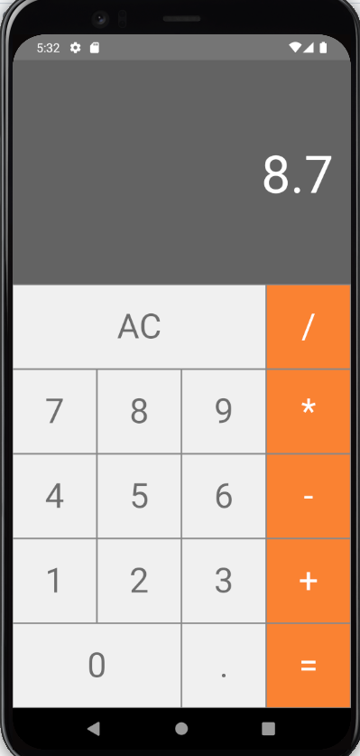

# Calculadora em React Native

Este é um projeto simples de uma calculadora desenvolvida utilizando o framework React Native. O objetivo principal deste projeto é me ajudar a praticar e consolidar meus conhecimentos em React Native, além de me familiarizar com conceitos fundamentais de desenvolvimento mobile.

## Funcionalidades

- Realiza operações básicas de cálculo, como adição, subtração, multiplicação e divisão.
- Interface intuitiva e fácil de usar, seguindo os padrões de design do React Native.
- Adaptação a diferentes tamanhos de tela, garantindo uma experiência consistente em diversos dispositivos.

## Captura de Tela

## Como Utilizar

1. Certifique-se de ter o ambiente de desenvolvimento React Native configurado em sua máquina.
2. Clone este repositório: `git clone https://github.com/seu-usuario/calculadora-react-native.git`
3. Navegue até o diretório do projeto: `cd calculadora-react-native`
4. Instale as dependências: `npm install` ou `yarn install`
5. Inicie o aplicativo: `npm start` ou `yarn start`
6. Use um emulador ou instale o aplicativo diretamente em um dispositivo físico.

## Contribuições

Contribuições são bem-vindas! Se você identificar algum problema, bug ou tiver alguma sugestão de melhoria, sinta-se à vontade para abrir uma issue ou enviar um pull request.

---

Agradeço por conferir este projeto. Espero que ele possa ser útil para outros desenvolvedores iniciantes em React Native, assim como foi para mim. Se tiver alguma dúvida ou comentário, não hesite em entrar em contato.

Desenvolvido por Lucas Nardelli
